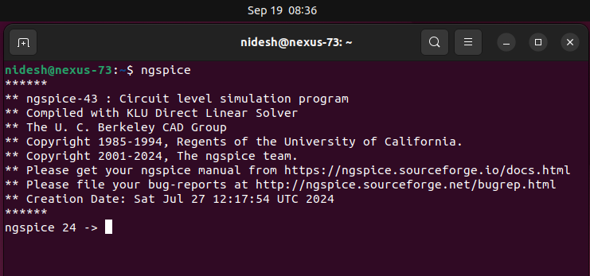
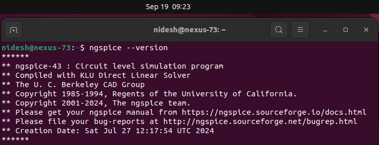
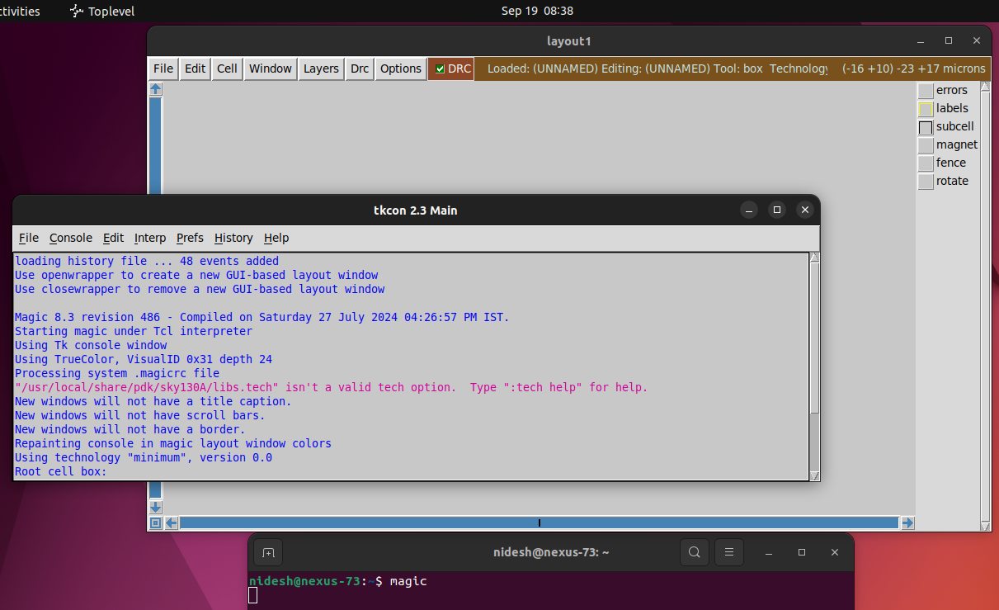
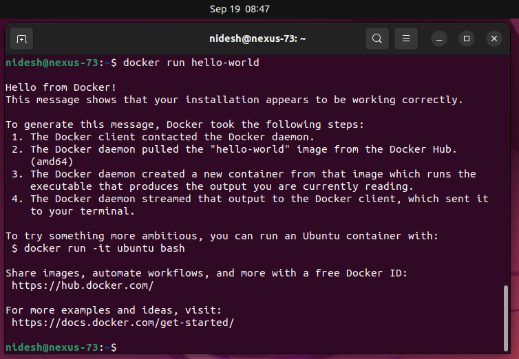
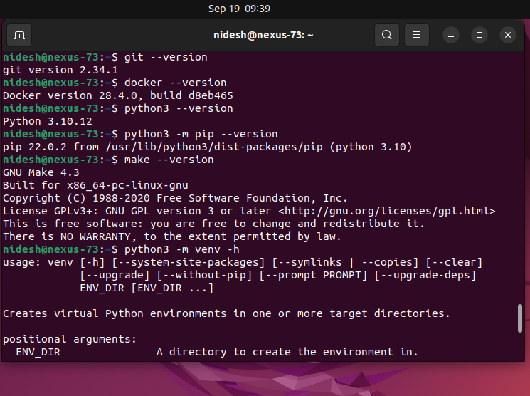
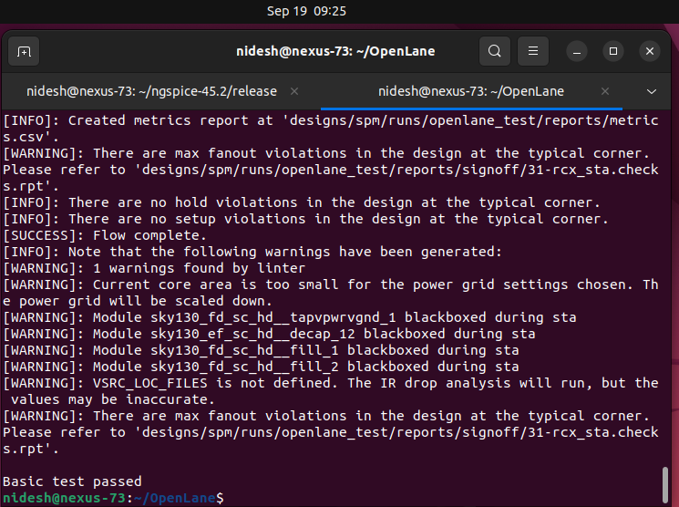

# Week 0 – Getting Started with Digital VLSI SoC Design and Tools

## 📌 Overview
This week covers the initial setup for the VLSI SoC design journey.  
It has three main tasks:
1. **Getting started with Digital VLSI SoC Design and Planning** (video summary)  
2. **Tools installation** (Yosys, Icarus Verilog, GTKWave, Ngspice, Magic, OpenLANE)  
3. **GitHub submission** of Week 0 repo  

---

## 📝 Task 1: Getting Started with Digital VLSI SoC Design
- **Summary of the introductory video**  
  👉 *(Write your summary here in 5–10 bullet points)*  

Example outline (replace with your own notes):  
- Introduction to Digital VLSI design flow.  
- Overview of RTL-to-GDSII stages.  
- Importance of open-source EDA tools.  
- Planning chip design projects in structured phases.  
- Role of fabrication PDKs and open-source communities.  

---

## 🛠️ Task 2: Tools Installation Instructions

System Requirements:  
- Ubuntu 20.04+ (✅ I used Ubuntu 22.04)  
- Minimum Req.: 6 GB RAM, 50 GB HDD, 4 vCPU

### Installed Tools
Below are the steps followed for each tool installation. Screenshots are added for verification.

---

### 🔹 Yosys
```bash
sudo apt-get update
git clone https://github.com/YosysHQ/yosys.git
cd yosys
sudo apt install make build-essential clang bison flex \
libreadline-dev gawk tcl-dev libffi-dev git \
graphviz xdot pkg-config python3 libboost-system-dev \
libboost-python-dev libboost-filesystem-dev zlib1g-dev
make config-gcc
make
sudo make install
```
## Installation image:
  

✅ Verify with:
```bash
yosys --version
```
   
   
### 🔹 Icarus Verilog (iverilog)
```bash
sudo apt-get update
sudo apt-get install iverilog
```
## Installation image:
  

✅ Verify with:
```bash
iverilog -V
```
  

### 🔹 GTKWave
```bash
sudo apt-get update
sudo apt-get install gtkwave
```
## Installation image:
  
  
✅ Verify with:
```bash
gtkwave --version
```
  

### 🔹 Ngspice
```bash
tar -zxvf ngspice-37.tar.gz
cd ngspice-37
mkdir release && cd release
../configure --with-x --with-readline=yes --disable-debug
make
sudo make install
```
## Installation image:
  
  
✅ Verify with:
```bash
ngspice --version
```
  

### 🔹 Magic VLSI
```bash
sudo apt-get install m4 tcsh csh libx11-dev \
tcl-dev tk-dev libcairo2-dev mesa-common-dev libglu1-mesa-dev libncurses-dev
git clone https://github.com/RTimothyEdwards/magic
cd magic
./configure
make
sudo make install
```
## Installation image:
  
  
✅ Verify with:
```bash
magic -d XR
```
  

### 🔹 OpenLANE (with Docker)
```bash
sudo apt-get update && sudo apt-get upgrade
sudo apt install -y build-essential python3 python3-venv python3-pip make git
sudo apt install apt-transport-https ca-certificates curl software-properties-common
curl -fsSL https://download.docker.com/linux/ubuntu/gpg | sudo gpg --dearmor -o \
/usr/share/keyrings/docker-archive-keyring.gpg
echo "deb [arch=amd64 signed-by=/usr/share/keyrings/docker-archive-keyring.gpg] \
https://download.docker.com/linux/ubuntu $(lsb_release -cs) stable" | \
sudo tee /etc/apt/sources.list.d/docker.list > /dev/null
sudo apt update
sudo apt install docker-ce docker-ce-cli containerd.io

#Post-install:

sudo docker run hello-world
sudo groupadd docker
sudo usermod -aG docker $USER
sudo reboot
```
## After reboot:
```bash
docker run hello-world
```
## Hello-world Docker output:
  
  
## Dependencies check:
```bash
git --version
docker --version
python3 --version
python3 -m pip --version
make --version
python3 -m venv -h
```
## Version Check:
  

### Clone & build OpenLANE:
```bash
cd $HOME
git clone https://github.com/The-OpenROAD-Project/OpenLane
cd OpenLane
make
make test
```
✅ Verify with test run output.
## OpenLane Test Result:
  

📤 Task 3: GitHub Submission

    This repo serves as the Week 0 submission.

    Link to repo: [Replace with your GitHub repo link here]

✅ Final Notes

    All required tools were successfully installed on Ubuntu 22.04.

    Screenshots are provided for verification.

    This setup will be reused in upcoming weeks for RTL-to-GDSII flow.

