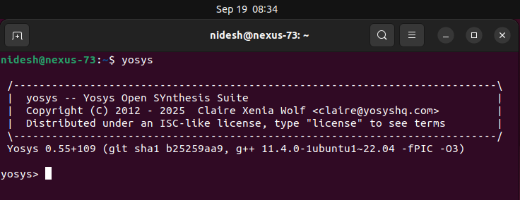
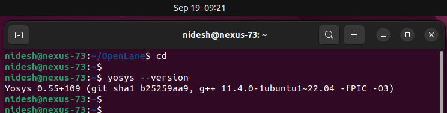
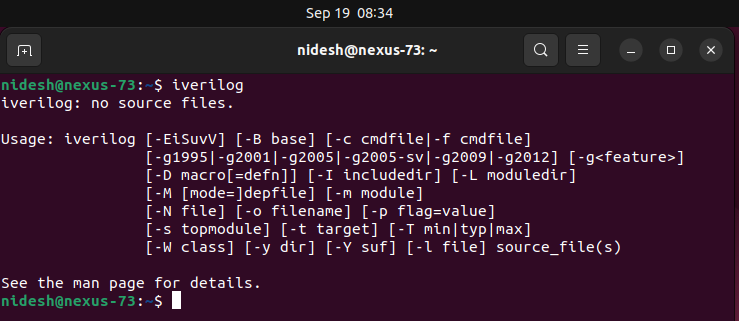
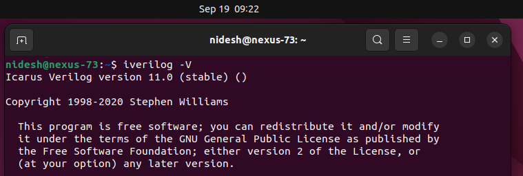
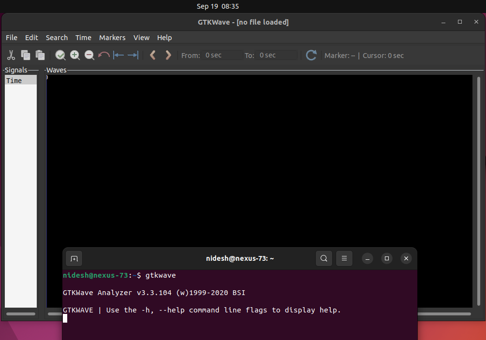
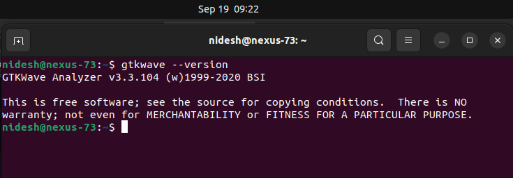

# Week 0 – Getting Started with Digital VLSI SoC Design and Tools

## 📌 Overview
This week covers the initial setup for the VLSI SoC design journey.  
It has three main tasks:
1. **Getting started with Digital VLSI SoC Design and Planning** (video summary)  
2. **Tools installation** (Yosys, Icarus Verilog, GTKWave)  
3. **GitHub submission** of Week 0 repo  

---

## 📝 Task 1: Getting Started with Digital VLSI SoC Design
- **Summary of the introductory video**  
  👉 *(Write your summary here in 5–10 bullet points)*  

Example outline (replace with your own notes):  
- Introduction to Digital VLSI design flow.  
- Overview of RTL-to-GDSII stages.  
- Importance of open-source EDA tools.  
- Planning chip design projects in structured phases.  
- Role of fabrication PDKs and open-source communities.  

---

## 🛠️ Task 2: Tools Installation Instructions

System Requirements:  
- Ubuntu 20.04+ (✅ I used Ubuntu 22.04)  
- Minimum Req.: 6 GB RAM, 50 GB HDD, 4 vCPU

### Installed Tools
Below are the steps followed for each tool installation. Screenshots are added for verification.

---

### 🔹 Yosys
```bash
sudo apt-get update
git clone https://github.com/YosysHQ/yosys.git
cd yosys
sudo apt install make build-essential clang bison flex \
libreadline-dev gawk tcl-dev libffi-dev git \
graphviz xdot pkg-config python3 libboost-system-dev \
libboost-python-dev libboost-filesystem-dev zlib1g-dev
make config-gcc
make
sudo make install
```
## Installation image:
  

✅ Verify with:
```bash
yosys --version
```
   
   
### 🔹 Icarus Verilog (iverilog)
```bash
sudo apt-get update
sudo apt-get install iverilog
```
## Installation image:
  

✅ Verify with:
```bash
iverilog -V
```
  

### 🔹 GTKWave
```bash
sudo apt-get update
sudo apt-get install gtkwave
```
## Installation image:
  
  
✅ Verify with:
```bash
gtkwave --version
```
  

## 🔄 Simple RTL Design Flow (Using Installed Tools)

To validate the toolchain, a small Verilog design can be tested end-to-end.

### Step 1: Write a Verilog file  
Example: `and_gate.v`
```verilog
module and_gate (input a, input b, output y);
  assign y = a & b;
endmodule
```
### Step 2: Write a Testbench

Example: `tb_and_gate.v`
```verilog
module tb_and_gate;
  reg a, b;
  wire y;

  and_gate uut (.a(a), .b(b), .y(y));

  initial begin
    $dumpfile("and_gate.vcd");
    $dumpvars(0, tb_and_gate);
    
    a=0; b=0; #10;
    a=0; b=1; #10;
    a=1; b=0; #10;
    a=1; b=1; #10;
    $finish;
  end
endmodule
```
### Step 3: Simulate with Icarus Verilog
```bash
iverilog -o and_gate_tb tb_and_gate.v and_gate.v
vvp and_gate_tb
```
### Step 4: View Waveforms in GTKWave
```bash
gtkwave and_gate.vcd
```
### Step 5: Optional – Synthesis with Yosys
```bash
yosys
yosys> read_verilog and_gate.v
yosys> synth -top and_gate
yosys> write_json and_gate.json
```

✅ This validates the installed tools:

    Icarus Verilog → Compiles & simulates

    GTKWave → Visualizes waveforms

    Yosys → Performs synthesis


📤 Task 3: GitHub Submission

This repository serves as the official Week 0 submission.
👉 Repo link: [https://github.com/Nideshkanna/week0-getting-started]

✅ Final Notes

- Successfully installed Yosys, Icarus Verilog, and GTKWave on Ubuntu 22.04.
- Verification screenshots confirm working installations.
- This setup lays the foundation for the upcoming RTL-to-GDSII design flow.
- Future weeks will build upon this environment with additional tools.
