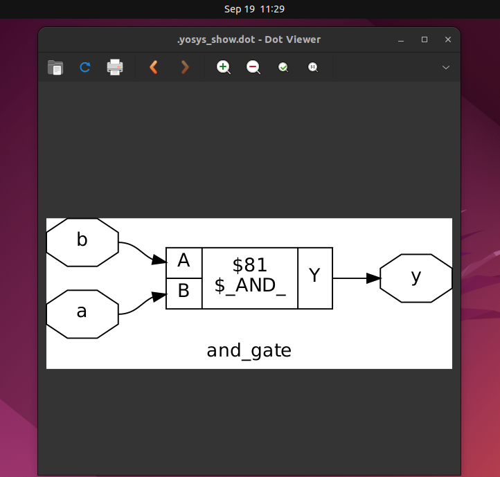

# 🖥️ RISC-V Reference SoC Tapeout Program VSD

# Week 0 – Getting Started with Digital VLSI SoC Design and Tools

## 📌 Overview
This week covers the initial setup for the VLSI SoC design journey.  
It has three main tasks:
1. **Getting started with Digital VLSI SoC Design and Planning** (video summary)  
2. **Tools installation** (Yosys, Icarus Verilog, GTKWave)  
3. **GitHub submission** of Week 0 repo  

---

# 🚀 Getting Started with Digital VLSI SoC Design  

This guide outlines the **complete workflow** for a Digital VLSI (Very Large-Scale Integration) SoC (System on Chip) design, from **high-level modeling** to **final silicon fabrication**.  
The **core principle** is to maintain **functional equivalence** across all stages →  
**O0 = O1 = O2 = O3 = O4** ✅  

---

## 📝 The Design Philosophy  

> **Golden Rule of Verification:**  
> The functional output must remain **identical** across every abstraction stage.  

- A **C-language testbench** serves as the **single source of truth** ("golden model").  
- Ensures correctness from **specification → RTL → SoC integration → silicon**.  
- Guarantees a **reliable, manufacturable chip design**.  

---

## 📊 Processor Compilation Stages  

| Stage | Description | Key Artifact |
|-------|-------------|--------------|
| **O0** | C Program | High-level C application code. |
| **O1** | Chip Modelling (Specs) | Executable C model specification. |
| **O2** | RTL Architect | RTL hardware description (Verilog “soft copy”). |
| **O3** | SoC Integration | Processor + peripherals/IPs integration (GPIO, memory, etc.). |
| **O4** | Final Silicon Board | Fabricated board after tape-in. |

---

## 🔄 The Digital VLSI Design Flow  

1. **Chip Modelling (Specs – C model)**  
   - Define chip behavior in **C**.  
   - Serves as the **blueprint** and reference.  

2. **RTL Design (Verilog)**  
   - Convert C model → RTL description.  
   - Partition into **processor + peripherals/IPs**.  

3. **ASIC Synthesis**  
   - Translate RTL → **Gate-level netlist**.  
   - Map design to **standard cell libraries**.  
   - Integrate macros + analog IPs.  

4. **RTL-to-GDS (Physical Design)**  
   - **Floorplanning** → Place blocks.  
   - **Placement** → Arrange standard cells.  
   - **Routing** → Connect wires.  
   - Output → **GDSII file** (mask data).  

5. **Tape-Out**  
   - Perform **DRC/LVS checks** to ensure manufacturability.  
   - Send final **GDSII** to foundry.  

6. **Tape-In**  
   - Fabricate silicon wafers.  
   - Cut into dies → package into **final chip**.  

  

---

## 🛠️ Key Takeaways  

- **Abstractions are key** → From high-level C model → low-level GDSII.  
- **Verification is king** → Same **C testbench** ensures correctness at every stage.  
- **Structured flow matters** → Breaking into clear phases simplifies SoC project management.  

---

## 🛠️ Task 2: Tools Installation Instructions

System Requirements:  
- Ubuntu 20.04+ (✅ I used Ubuntu 22.04)  
- Minimum Req.: 6 GB RAM, 50 GB HDD, 4 vCPU

### Installed Tools
Below are the steps followed for each tool installation. Screenshots are added for verification.

---

### 🔹 Yosys
```bash
sudo apt-get update
git clone https://github.com/YosysHQ/yosys.git
cd yosys
sudo apt install make build-essential clang bison flex \
libreadline-dev gawk tcl-dev libffi-dev git \
graphviz xdot pkg-config python3 libboost-system-dev \
libboost-python-dev libboost-filesystem-dev zlib1g-dev
make config-gcc
make
sudo make install
```
## Installation image:
  

✅ Verify with:
```bash
yosys --version
```
   
   
### 🔹 Icarus Verilog (iverilog)
```bash
sudo apt-get update
sudo apt-get install iverilog
```
## Installation image:
  

✅ Verify with:
```bash
iverilog -V
```
  

### 🔹 GTKWave
```bash
sudo apt-get update
sudo apt-get install gtkwave
```
## Installation image:
  
  
✅ Verify with:
```bash
gtkwave --version
```
  

## 🔄 Simple RTL Design Flow (Using Installed Tools)

To validate the toolchain, a small Verilog design can be tested end-to-end.

### Step 1: Write a Verilog file  
Example: `and_gate.v`
```verilog
module and_gate (input a, input b, output y);
  assign y = a & b;
endmodule
```
## Executed Image
  
  
### Step 2: Write a Testbench
Example: `tb_and_gate.v`
```verilog
module tb_and_gate;
  reg a, b;
  wire y;

  and_gate uut (.a(a), .b(b), .y(y));

  initial begin
    $dumpfile("and_gate.vcd");
    $dumpvars(0, tb_and_gate);
    
    a=0; b=0; #10;
    a=0; b=1; #10;
    a=1; b=0; #10;
    a=1; b=1; #10;
    $finish;
  end
endmodule
```
## Executed Image
  

### Step 3: Simulate with Icarus Verilog
```bash
iverilog -o and_gate_tb tb_and_gate.v and_gate.v
vvp and_gate_tb
```
## Executed Image
  

✅ Successful simulation with Icarus Verilog – generated and_gate.vcd for waveform view in GTKWave.

### Step 4: View Waveforms in GTKWave
```bash
gtkwave and_gate.vcd
```
## Executed Image
  

### Step 5: Optional – Synthesis with Yosys
```bash
yosys
yosys> read_verilog and_gate.v
yosys> synth -top and_gate
yosys> write_json and_gate.json
```
## Executed Image
  

✅ Yosys started and Verilog design (and_gate.v) was read into synthesis flow.
  
  

✅ Yosys synthesis completed – statistics show 1 logic cell ($_AND_) inferred.

✅ and_gate.json generated – JSON netlist representation of the synthesized AND gate.

## To Visualize The design use these command
```bash
yosys
read_verilog and_gate.v
synth -top and_gate #top_module_name
show
```
## Design code visualization 

  
  
✅ This validates the installed tools:

    Icarus Verilog → Compiles & simulates

    GTKWave → Visualizes waveforms

    Yosys → Performs synthesis
    
### 🔹 Ngspice
```bash
tar -zxvf ngspice-37.tar.gz
cd ngspice-37
mkdir release && cd release
../configure --with-x --with-readline=yes --disable-debug
make
sudo make install
```
## Installation image:
  
  
✅ Verify with:
```bash
ngspice --version
```
  

### 🔹 Magic VLSI
```bash
sudo apt-get install m4 tcsh csh libx11-dev \
tcl-dev tk-dev libcairo2-dev mesa-common-dev libglu1-mesa-dev libncurses-dev
git clone https://github.com/RTimothyEdwards/magic
cd magic
./configure
make
sudo make install
```
## Installation image:

✅ Verify with:
```bash
magic -d XR
```
  

### 🔹 OpenLANE (with Docker)
```bash
sudo apt-get update && sudo apt-get upgrade
sudo apt install -y build-essential python3 python3-venv python3-pip make git
sudo apt install apt-transport-https ca-certificates curl software-properties-common
curl -fsSL https://download.docker.com/linux/ubuntu/gpg | sudo gpg --dearmor -o \
/usr/share/keyrings/docker-archive-keyring.gpg
echo "deb [arch=amd64 signed-by=/usr/share/keyrings/docker-archive-keyring.gpg] \
https://download.docker.com/linux/ubuntu $(lsb_release -cs) stable" | \
sudo tee /etc/apt/sources.list.d/docker.list > /dev/null
sudo apt update
sudo apt install docker-ce docker-ce-cli containerd.io

#Post-install:

sudo docker run hello-world
sudo groupadd docker
sudo usermod -aG docker $USER
sudo reboot
```
## After reboot:
```bash
docker run hello-world
```
## Hello-world Docker output:
  
  
## Dependencies check:
```bash
git --version
docker --version
python3 --version
python3 -m pip --version
make --version
python3 -m venv -h
```
## Version Check:
  

### Clone & build OpenLANE:
```bash
cd $HOME
git clone https://github.com/The-OpenROAD-Project/OpenLane
cd OpenLane
make
make test
```
✅ Verify with test run output.
## OpenLane Test Result:
  


📤 Task 3: GitHub Submission

This repository serves as the official Week 0 submission.

👉 Week0 Repo link: [https://github.com/Nideshkanna/week0-getting-started]

👉 Week1 Repo link: [Coming Soon]

👉 Main Repo Link : [https://github.com/Nideshkanna/riscv-soc-tapeout]

✅ Final Notes

| ✅ Tool            | ⚙️ Description                                  | 📌 Status        |
|--------------------|------------------------------------------------|-----------------|
| Yosys              | RTL synthesis tool for digital circuits         | ✔️ Installed     |
| Icarus Verilog     | Verilog simulation and testbench execution      | ✔️ Installed     |
| GTKWave            | Waveform viewer for simulation results          | ✔️ Installed     |
| Ngspice            | Circuit-level SPICE simulation engine           | ✔️ Installed     |
| Magic              | VLSI layout editor and design rule checker      | ✔️ Installed     |
| OpenLane           | Complete RTL-to-GDSII ASIC design flow tool     | ✔️ Installed     |


- Verification screenshots confirm working installations.
- This setup lays the foundation for the upcoming RTL-to-GDSII design flow.
- Future weeks will build upon this environment with additional tools.
